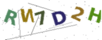

# Turing Test and CAPTCHA — Architecture Design

**Reference:** *Russell & Norvig, Artificial Intelligence: A Modern Approach (AIMA), Chapter 1*

---

# 1. The Turing Test

## Definition

The **Turing Test**, proposed by Alan Turing in 1950, is a method to evaluate whether a machine can exhibit intelligent behaviour indistinguishable from a human.

In the test:

1. A human evaluator communicates with **two participants** through text.
2. One participant is a **human**, and the other is a **machine**.
3. If the evaluator **cannot reliably distinguish** the machine from the human, the machine is considered to have passed the Turing Test.

---

## Capabilities Required

According to *Artificial Intelligence: A Modern Approach*, a system capable of passing the Turing Test requires:

* **Natural Language Processing (NLP)** — to understand and generate human language
* **Knowledge Representation** — to store facts about the world
* **Automated Reasoning** — to answer questions and draw conclusions
* **Machine Learning** — to improve responses over time

---

## Turing Test Architecture
```
+--------------------------------------------------+
|                 TURING TEST SYSTEM               |
+-----------------------+--------------------------+
|       HUMAN SIDE      |       MACHINE SIDE       |
|                       |                          |
| Human types message   |  Natural Language        |
|                       |  Processing (NLP)        |
|                       |                          |
|                       |  Dialogue Manager        |
|                       |                          |
|                       |  Knowledge Base          |
|                       |                          |
|                       |  Response Generator      |
+-----------------------+--------------------------+
            |
            v
      HUMAN EVALUATOR
   "Human or Machine?"
```

---

# 2. CAPTCHA

## Definition

**CAPTCHA** — Completely Automated Public Turing test to tell Computers and Humans Apart.

It prevents **automated bots** from performing actions such as:

* creating fake accounts
* submitting spam forms
* brute-force login attempts

CAPTCHA relies on tasks **easy for humans but difficult for machines**.

---

## CAPTCHA Architecture

### Step 1 — Challenge Generator

* Generate random string or image
* Apply distortion and noise
* Store correct answer

### Step 2 — User Interface

* Display challenge to user
* Accept typed or click response

### Step 3 — Response Verification

* Compare response to stored answer
* Check timing (too fast = bot)
* Detect suspicious behaviour

### Result
```
PASS  →  Access Granted
FAIL  →  New CAPTCHA Challenge
```

---

## Types of CAPTCHA

| Type | Description |
|------|-------------|
| Text CAPTCHA | User types distorted characters |
| Image CAPTCHA | Select images matching a category |
| Audio CAPTCHA | Recognize spoken numbers with noise |
| reCAPTCHA v3 | Invisible behaviour-based scoring |

---

# 3. Turing Test vs CAPTCHA

| Feature | Turing Test | CAPTCHA |
|---------|-------------|---------|
| Purpose | Evaluate machine intelligence | Block automated bots |
| Judge | Human evaluator | Automated system |
| Direction | Machine pretends to be human | System verifies user is human |
| Usage | AI research | Web security |

---

# 4. Agent Classification

| System | Agent Type |
|--------|-----------|
| Turing Test conversational bot | Learning Agent |
| CAPTCHA generator | Simple Reflex Agent |
| CAPTCHA solving bot | Model-Based + Learning Agent |

---

## Sample Generated CAPTCHA Image



---

## Implementation Files

| File | Purpose |
|------|---------|
| captcha_generator.py | Terminal CAPTCHA with timing-based bot detection |
| captcha_image.py | Image CAPTCHA with distortion and noise |
| captcha_demo.py | Full Turing Test simulation + CAPTCHA demo |

---

# Reference

Russell, S., & Norvig, P. (2021).
*Artificial Intelligence: A Modern Approach* (4th Edition). Pearson.
